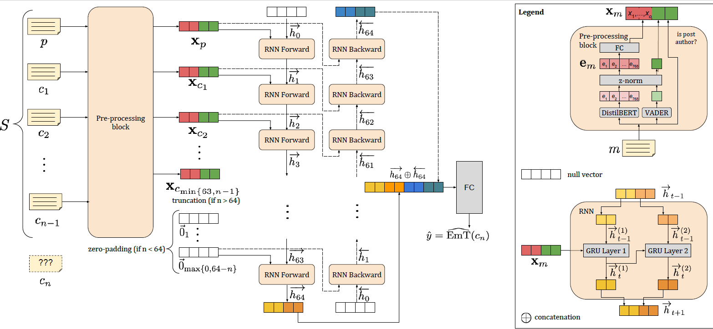

# SentiMentalHealth

PyTorch implementation of our GRU-based RNN for predicting user emotional tone in online mental disorder communities.

## Introduction

This repository provides the original implementation of the "Predicting User Emotional Tone in Mental Disorder Online Communities". The paper was published in the [FGCS Special Issue on Sentiment Analysis Systems](https://www.journals.elsevier.com/future-generation-computer-systems/call-for-papers/special-issue-on-senti-mental-health-future-generation-senti). The paper can also be found on [arXiv](https://arxiv.org/).
The chosen model for extracting the sentiment features from reddit posts and comments was the [VADER Sentiment Analysis Tool](https://github.com/cjhutto/vaderSentiment).

## Contents and Usage

This repository contains four python notebooks, each accomplishing a specific part of the proposed pipeline. We highlight that all the notebooks are already configured for enabling users to reproduce the paper's results. 

* The [REDDIT_SCRAPPER](REDDIT_SCRAPPER.ipynb) notebook downloads the data from a given subreddit using reddit's API. 
* The [PRE_PROCESSING](PRE_PROCESSING.ipynb) notebook transforms the data into a single dataframe containing all the information needed for training(VADER's scores, relevant statistics about the threads, etc.)
* The [PAPER_RESULTS](PAPER_RESULTS.ipynb) notebook performs the actual training of the model and the analysis of the results.
* The [REVIEW_EXPERIEMENTS](REVIEW_EXPERIMENTS.ipynb) notebook is an extra part of the pipeline, that performs confidence interval experiments and other relevant but not essential studies for the model.

The [Source](src) folder contains the .py files with useful functions and, most importantly, the Pytorch implementation of the model itself. 

### Reproducing the Paper results
The main goal of this repository is reproducibility, and so we succinctly describe the pipeline one should follow to reproduce our results.
1. Run the [REDDIT_SCRAPPER](REDDIT_SCRAPPER.ipynb) notebook. We recommend running this locally, since Google Colab doesn't handle asynchronous functions all that well. This can take a while since subreddits like r/depression contain a significant amount of threads.

    *Alternatively*, you can download the compressed dataset files from the authors' OneCloud drives:
    * [r/Anxiety](https://ufmgbr-my.sharepoint.com/:u:/g/personal/murai_ufmg_br/EdcIY6UHxPZIhr9sszKIk_8BFV21SzVQYjmdDJWyvKTdtw?e=eEr8lR)
    * [r/bipolar](https://ufmgbr-my.sharepoint.com/:u:/g/personal/murai_ufmg_br/Ed6UrGbsGK9AhFgSxFfYum0BFoz_GPaN3_H1D6PRpD9hSw?e=bu80dW)
    * [r/depression](https://ufmgbr-my.sharepoint.com/:u:/g/personal/murai_ufmg_br/Eedv1m0ihBBGq9kvxDJCHWUBqVVQYyqEGda7yduI9udc2w?e=I9Phj0)
    * [r/SuicideWatch](https://ufmgbr-my.sharepoint.com/:u:/g/personal/murai_ufmg_br/EYvlqWc21kVHlQL2l7qObQEB5913RyufIFPzgHxfOtWpkw?e=bedSIT)

    Do NOT forget to uncompress and save the .pkl files to a folder named 'data'.

2. Run the [PRE_PROCESSING](PRE_PROCESSING.ipynb) notebook. We recommend running this on colab, since it requires TPU support. This will also take a while since obtaining the VADER sentiment scores is a costly task.

There are two options for the final step of the pipeline.
#### Option 1: Training the model from Scratch
3. Run the [PAPER_RESULTS](PAPER_RESULTS.ipynb) notebook. Unfortunately, since we first obtained the results, Google Colab has reduced the amount of available RAM for free users, and so training the model for all 4 subreddits is not currently possible in the free version of Colab. For this reason, we recommend running this notebook locally, on a machine with GPU support and more than 14GB of RAM. 
#### Option 2: Loading pre-trained parameters (TODO)
3. Load the [pre-trained parameters]() pickle file, which contains the RNN state_dict, and then proceed only to test the model using the downloaded data. We still recommend using a machine with GPU support and more than 14GB of RAM, since Colab may have issues loading all of the subreddits data.

After following these three steps, you will have access to the trained model used in the paper. The [PAPER_RESULTS](PAPER_RESULTS.ipynb) notebook automatically generates the results table and performs case studies for specific threads.

A command-line version of the model will be available in the future, but currently only the used notebooks are available.

## License \& Disclaimer
This is research code, expect that it can change and any fitness for a particular purpose is disclaimed.

This software is under GNU General Public License Version 3 ([GPLv3](LICENSE)).

## Authors
Bárbara Silveira, Henrique S. Silva, Fabricio Murai, Ana Paula C. da Silva

